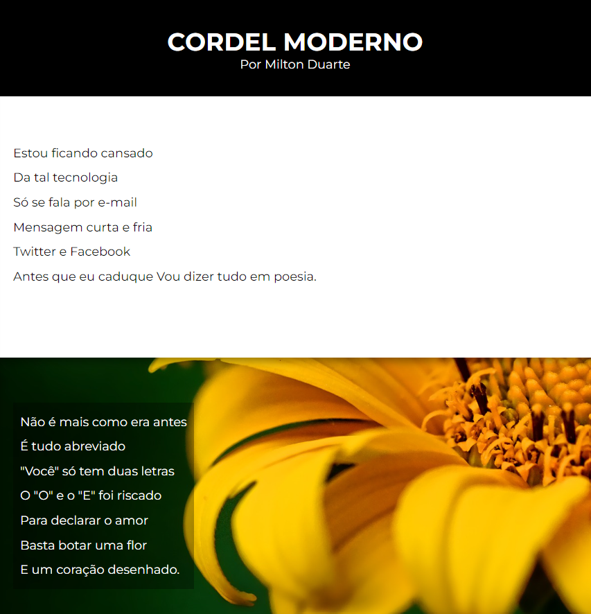

<h1 align="center"> Projeto de aprendizagem de HTML e CSS </h1>

Projeto de página de Cordel Moderno por Milton Duarte.  

  <a href="#-tecnologias">Tecnologias</a>&nbsp;&nbsp;&nbsp;|&nbsp;&nbsp;&nbsp;
  <a href="#-projeto">Projeto</a>&nbsp;&nbsp;&nbsp;|&nbsp;&nbsp;&nbsp;
  <a href="#-layout">Layout</a>&nbsp;&nbsp;&nbsp;|&nbsp;&nbsp;&nbsp;

 

  

## 🚀 Tecnologias

Esse projeto foi desenvolvido com as seguintes tecnologias:

- HTML e CSS
- Git e Github

## 💻 Projeto

Página de aprendizado de HTML e .css com efeito paralax.

- [Acesse o código do projeto finalizado, online](https://github.com/matheusamartim/cordel)

## 🔖 Layout

Você pode visualizar o layout do projeto através [desse link](https://matheusamartim.github.io/cordel/).

---

Feito com ♥

# android
